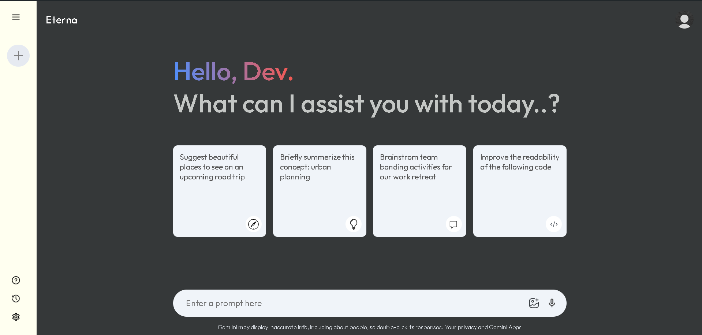

# 🫧 Eterna-Gemini Clone 

🌟 Eterna-Gemini App: Your Gateway to Cutting-Edge AI
Welcome to the Gemini app, an innovative AI application harnessing the power of Google's Gemini API. With Gemini, you can seamlessly interact with advanced generative AI models through an intuitive and user-friendly interface.

🚀 Features
💬 Chat Interface
Engage in conversations with the Gemini model through our sleek and dedicated chat interface. Experience AI like never before, with responses that feel natural and personalized.

✨ Simulated Typing Effect
Enhance your interaction experience with our simulated typing effect, designed to mimic human typing for a more immersive and lifelike conversation.

🌐 Google Gemini Integration
Leverage the powerful capabilities of the Google Gemini model. Generate informative and relevant responses, perform various AI-related tasks, and unlock the full potential of generative AI.

⚡ Technologies
🖥️ Frontend: React.js
Our dynamic user interface is built with React.js, ensuring a responsive and smooth user experience.

🔗 Backend: Gemini API
The core of our app, the Gemini API, powers all AI functionalities, providing robust and reliable access to cutting-edge AI technology.

🎨 Styling: CSS
We use CSS to create a visually appealing and user-friendly design, ensuring that your interaction with the app is not only powerful but also pleasant.

Feel free to explore, modify, and enhance this project further!
